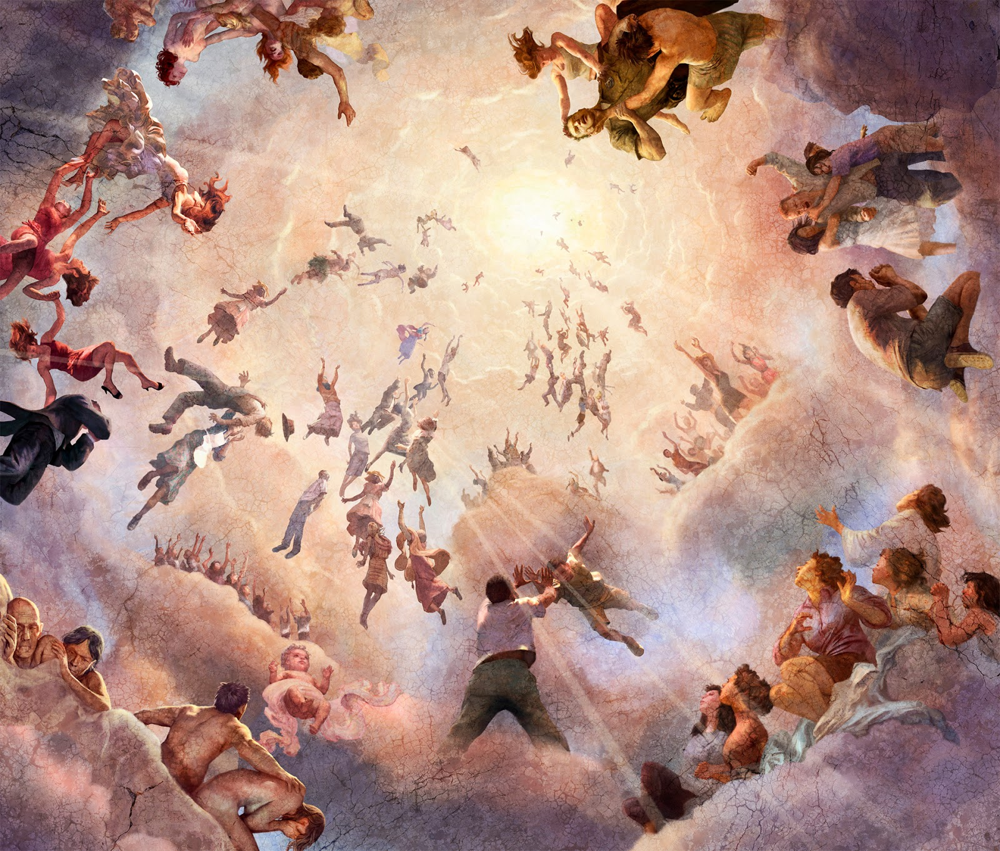

---

Download this wallpaper: [Here](./assets/rapture.jpg).

---

<iframe width="640" height="360" scrolling="no" frameborder="0" style="border: none;" src="https://www.bitchute.com/embed/gyttv4NHJGyp/"></iframe>

You can find more videos from this author: [Here](https://www.bitchute.com/channel/lTzFq9ZFR8Dw/).

---

<iframe width="640" height="360" scrolling="no" frameborder="0" style="border: none;" src="https://www.bitchute.com/embed/Z2Cy6jRNAGjT/"></iframe>

You can find more videos from this author: [Here](https://www.bitchute.com/channel/hNVjsYmtRqcR/).

---

<iframe width="560" height="315" src="https://www.youtube.com/embed/fBtJ1EtoCN8?si=1JY7pQ5eoqTZdG-H" title="YouTube video player" frameborder="0" allow="accelerometer; autoplay; clipboard-write; encrypted-media; gyroscope; picture-in-picture; web-share" allowfullscreen></iframe>

---

<iframe width="560" height="315" src="https://www.youtube.com/embed/bDnA_coA168?si=3lhbnTHJNGvAvyPS" title="YouTube video player" frameborder="0" allow="accelerometer; autoplay; clipboard-write; encrypted-media; gyroscope; picture-in-picture; web-share" allowfullscreen></iframe>

---

10 Because thou hast kept the word of my patience, I also will keep thee from the hour of temptation, which shall come upon all the world, to try them that dwell upon the earth.

---

AFTER this I looked, and, behold, a door *was* opened in heaven: and the first voice which I heard *was* as it were of a trumpet talking with me; which said, Come up hither, and I will shew thee things which must be hereafter.

2 And immediately I was in the spirit: and, behold, a throne was set in heaven, and *one* sat on the throne.

3 And he that sat was to look upon like a jasper and a sardine stone: and *there* *was* a rainbow round about the throne, in sight like unto an emerald.

4 And round about the throne *were* four and twenty seats: and upon the seats I saw four and twenty elders sitting, clothed in white raiment; and they had on their heads crowns of gold.

---

10 The four and twenty **elders** fall down before him that sat on the throne, and worship him that liveth for ever and ever, and cast their crowns before the throne, saying,

11 Thou art worthy, O Lord, to receive glory and honour and power: for thou hast created all things, and for thy pleasure they are and were created.

---

10 And six years thou shalt sow thy land, and shalt gather in the fruits thereof:

11 But the seventh _year_ thou shalt let it rest and lie still; that the poor of thy people may eat: and what they leave the beasts of the field shall eat. In like manner thou shalt deal with thy vineyard, _and_ with thy oliveyard.

---

22  And when ye reap the harvest of your land, thou shalt not make clean riddance of the corners of thy field when thou reapest, neither shalt thou gather any gleaning of thy harvest: thou shalt leave them unto the poor, and to the stranger: I _am_ the Lord your God.

---

29 Immediately after the tribulation of those days shall the sun be darkened, and the moon shall not give her light, and the stars shall fall from heaven, and the powers of the heavens shall be shaken:

30 And then shall appear the sign of the Son of man in heaven: and then shall all the tribes of the earth mourn, and they shall see the Son of man coming in the clouds of heaven with power and great glory.

31 And he shall send his angels with a great sound of a trumpet, and they shall gather together his elect from the four winds, from one end of heaven to the other.

---

BUT of the times and the seasons, brethren, ye have no need that I write unto you.

2 For yourselves know perfectly that the day of the Lord so cometh as a thief in the night.

3 For when they shall say, Peace and safety; then sudden destruction cometh upon them, as travail upon a woman with child; and they shall not escape.

4 But ye, brethren, are not in darkness, that that day should overtake you as a thief.

5 Ye are all the children of light, and the children of the day: we are not of the night, nor of darkness.

6 Therefore let us not sleep, as *do* others; but let us watch and be sober.

7 For they that sleep sleep in the night; and they that be drunken are drunken in the night.

8 But let us, who are of the day, be sober, putting on the breastplate of faith and love; and for an helmet, the hope of salvation.

9 For God hath not appointed us to wrath, but to obtain salvation by our Lord Jesus Christ,

10 Who died for us, that, whether we wake or sleep, we should live together with him.

11 Wherefore comfort yourselves together, and edify one another, even as also ye do.

12 And we beseech you, brethren, to know them which labour among you, and are over you in the Lord, and admonish you;

13 And to esteem them very highly in love for their work’s sake. *And* be at peace among yourselves.

14 Now we exhort you, brethren, warn them that are unruly, comfort the feebleminded, support the weak, be patient toward all *men*.

15 See that none render evil for evil unto any *man;* but ever follow that which is good, both among yourselves, and to all *men*.

16 Rejoice evermore.

17 Pray without ceasing.

18 In every thing give thanks: for this is the will of God in Christ Jesus concerning you.

19 Quench not the Spirit.

20 Despise not prophesyings.

21 Prove all things; hold fast that which is good.

22 Abstain from all appearance of evil.

23 And the very God of peace sanctify you wholly; and *I* *pray* *God* your whole spirit and soul and body be preserved blameless unto the coming of our Lord Jesus Christ.

24 Faithful *is* he that calleth you, who also will do *it*.

25 Brethren, pray for us.

26 Greet all the brethren with an holy kiss.

27 I charge you by the Lord that this epistle be read unto all the holy brethren.

28 The grace of our Lord Jesus Christ *be* with you. Amen.

​      ¶ The first *epistle* unto the Thessalonians was written from Athens.

---

<iframe width="560" height="315" src="https://www.youtube.com/embed/XOUybVX9wnU?si=UXAuCABFP1WqeJsp" title="YouTube video player" frameborder="0" allow="accelerometer; autoplay; clipboard-write; encrypted-media; gyroscope; picture-in-picture; web-share" allowfullscreen></iframe>

You can find more videos from this author: [Here](https://www.peace.org.au/).

---

<iframe width="560" height="315" src="https://www.youtube.com/embed/FpFGvSSEh28?si=VNGwT95PfRfEg2NB" title="YouTube video player" frameborder="0" allow="accelerometer; autoplay; clipboard-write; encrypted-media; gyroscope; picture-in-picture; web-share" allowfullscreen></iframe>

You can find more videos from this author: [Here](https://www.youtube.com/@WatchmanRiver).

---

<iframe width="560" height="315" src="https://www.youtube.com/embed/rwFsyFJ_-38?si=N5o-qA1-2DoE1q06" title="YouTube video player" frameborder="0" allow="accelerometer; autoplay; clipboard-write; encrypted-media; gyroscope; picture-in-picture; web-share" allowfullscreen></iframe>

You can find more videos from this author: [Here](https://www.youtube.com/@FaithInTheFire777).

---

<iframe width="640" height="360" scrolling="no" frameborder="0" style="border: none;" src="https://www.bitchute.com/embed/8THrHTnduIk7/"></iframe>

---

<iframe width="640" height="360" scrolling="no" frameborder="0" style="border: none;" src="https://www.bitchute.com/embed/YfiXBcK7O8Yf/"></iframe>

---

<iframe width="640" height="360" scrolling="no" frameborder="0" style="border: none;" src="https://www.bitchute.com/embed/Ke0c5nGTFMM/"></iframe>

---

<iframe width="640" height="360" scrolling="no" frameborder="0" style="border: none;" src="https://www.bitchute.com/embed/BOwv0zKU1Vc/"></iframe>

---

<iframe width="640" height="360" scrolling="no" frameborder="0" style="border: none;" src="https://www.bitchute.com/embed/OCJAuZ6lMks/"></iframe>

---

<iframe width="640" height="360" scrolling="no" frameborder="0" style="border: none;" src="https://www.bitchute.com/embed/JqoI5kGEGqeC/"></iframe>

You can find more videos from this author: [Here](https://www.bitchute.com/channel/hke6emnNyvWj/).

---

<iframe width="560" height="315" src="https://www.youtube.com/embed/9wMXu-pllzs?si=QdGKlfK52W6IviC0" title="YouTube video player" frameborder="0" allow="accelerometer; autoplay; clipboard-write; encrypted-media; gyroscope; picture-in-picture; web-share" allowfullscreen></iframe>

---

<iframe width="560" height="315" src="https://www.youtube.com/embed/95p-Fzxk2aQ?si=Mrbt6i3Ll6fOBSzu" title="YouTube video player" frameborder="0" allow="accelerometer; autoplay; clipboard-write; encrypted-media; gyroscope; picture-in-picture; web-share" allowfullscreen></iframe>

You can find more videos from this author: [Here](https://www.youtube.com/channel/UCmMLO7vxbA78hTr6EgguIYA).

---

---

[Website](https://www.jdfarag.org/)
[YouTube](https://www.youtube.com/@JDFaragTV)

---

[WebSite](https://watchmanriver.org/)
[YouTube](https://www.youtube.com/@WatchmanRiver)

---

[YouTube](https://www.youtube.com/@FaithInTheFire777)

---

[Blog 4 encouragements](https://encouragemen.blog/blog/)

---

[YouTube](https://www.youtube.com/@Generation2434)

---

[YouTube](https://www.youtube.com/@LastDaysAWAKENING)

---

[BitChute](https://www.bitchute.com/channel/hke6emnNyvWj/)

---

[WebSite](https://www.rev310.net/)

---

[Dean Odle](https://www.deanodle.org/)

---

[Jesus Encounter Ministries](https://www.jesusencounterministries.com/)
[YouTube](https://www.youtube.com/channel/UCmMLO7vxbA78hTr6EgguIYA)

---

[Omega Dynamics](https://www.omegadynamics.org/)
[Buffalo Base Camp](https://www.calicobuffalobasecamp.com/)
[YouTube](https://www.youtube.com/@jamiewalden756)

---

[richiefromboston.tv](https://richiefromboston.tv/)
[BitChute](https://www.bitchute.com/channel/juH53r3AyWVW/)
[TikTok](https://www.tiktok.com/@richiefromboston)

---

[YouTube](https://www.youtube.com/@jasonzelda/featured)

---

[thelastreformation.com](https://thelastreformation.com/)
[Map](https://map.thelastreformation.com/#)
[YouTube](https://www.youtube.com/@TheLastReformation)
[Friends of Torben](https://friendsoftorben.com/)

---

[BitChute](https://www.bitchute.com/channel/OVxXA0uDWdVr/)

---

[YouTube](https://www.youtube.com/@pastorcaryschmidt)

---

[Behold Israel](https://t.me/s/beholdisraelchannel)

[Generation2434](https://t.me/s/Generation2434)

[Watchman River](https://t.me/s/WatchmanRiverTom)

---

 [Download file Here](./assets/public_html.zip) 

---

ㅤㅤ
We are spreading God's word, 
at a time where people want to ban the (King James Version) bible. 

You are not allowed to sell, charge anything for this bible, 
but please share it with everyone around you.

There are 4 download locations for the bible.

The bible most likely will only be available for a limited time, 
so please hurry, grab your free copy.

I've made sure that there is no virus in the zipped file, 
but what happens on the internet, I can not take responsibility for. 
nor any damage you may face, using this software.

---

Download Locations: 
 [First Location](https://drive.google.com/file/d/12claUn5wws8BNZ15TrtzrjkHqA6AjI_W/view?usp=sharing) 
 [Second Location](https://drive.google.com/file/d/1nIob4Lk8895arc1_rpdLj4Nz3uKY1JSI/view?usp=sharing) 
 [Third Location](https://drive.google.com/file/d/12GOanEAg04X7tkq3dVH9Z7wF0yHC81pB/view?usp=sharing) 
 [Forth Location](https://drive.google.com/file/d/1ZIA2dnyxV4hOm00BzIZQzxnrKAkR0C04/view?usp=sharing)  

---

May you be lead by the HOLY SPIRIT, and maybe we'll meet in the sky really soon. 
God bless you. If you want to try the bible before downloading it, please go:
[Here](https://caught-up.net/bible/index.html)

___

Dear Heavenly ***Father***
You know *everything* about me,
and you know that I’m a *sinner*.

For many years, I have *loved my sins*.
I hereby *repent* from all *my sinful ways*.

I’m willing to *change with **Your** help*,
I receive your *forgiveness*, and I pray that ***you** help me*
*forgive* those, who have *hurt me*.

I know I only receive *forgiveness*, as I *forgive others*.

Thank You that *Jesus **Christ** died* on the cross for *us all*.
Thank You that He offers His *righteousness* to me,
and today this very day, I receive that *righteousness*.

I *hereby* put my *faith* in Him, the ***savior*** of the world.
So please God have *mercy* on me, a *sinner*.
***Save me Jesus Christ***, and today this very day,
***I commit my life to you Lord Jesus Christ***.

---

Download the document here:

 [PDF](./assets/the-road-to-salvation-main.pdf) 

 [Webp](./assets/the-road-to-salvation-main.webp) 

You can also see the document as a web-page: [Here](the-road-to-salvation.html).

---

If you have demonic powers effecting your life,

you might want to look at this prayer.

 [PDF](./assets/prayer-of-deliverance.pdf) 

 [Webp](./assets/prayer-of-deliverance.webp) 

You can also see the document as a web-page: [Here](prayer-of-deliverance.html).

---

